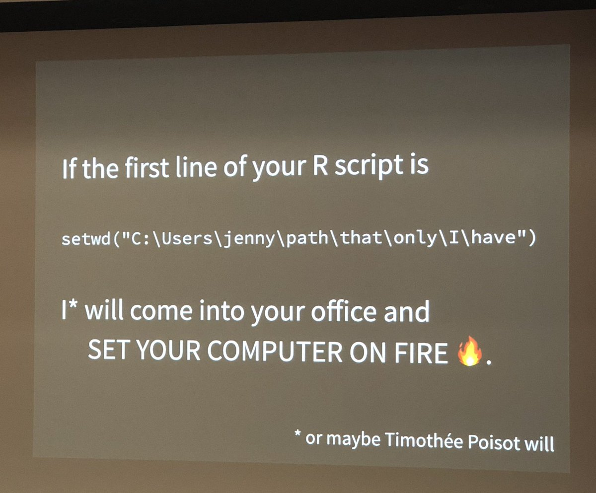
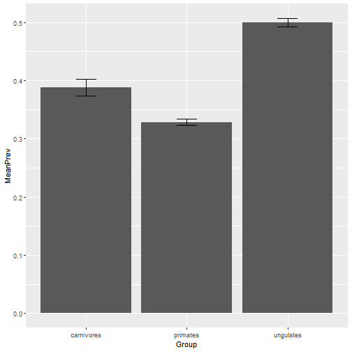
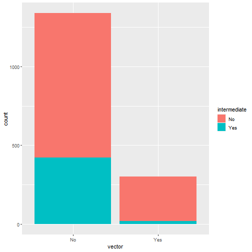
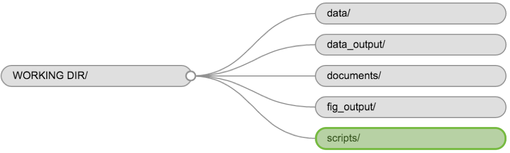
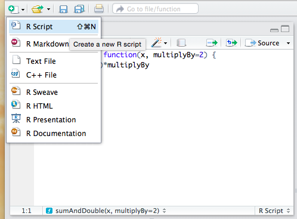
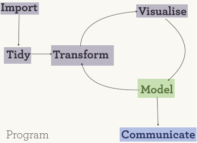

Reproducible Research with R
========================================================
author: Reni Kaul & Deven Gokhale & Zane Billings
date: 2022-06-06
autosize: true
font-import: https://fonts.googleapis.com/css?family=PT+Sans
font-family: 'PT Sans', sans-serif;

***
<div class="midcenter"><div style="margin-left:-0px;margin-top:500px;"></img></div></div>


About Myself
========================================================

 -  Epi/Bios PhD student with Andreas Handel.
 - I use data analysis and statistical models to study epidemiology and immunology of flu and norovirus.
 - I started using R and R Markdown in 2017.
 - I use R in my research to:
   + organize data 
   + visualize results
   + fit models
   + write reproducible manuscripts
   + pretty much everything I do is in R (Markdown), actually.
 - You can get my contact info at https://wzbillings.com. My office is on the HSC so feel free to take the bus, or just email me. I'm happy to answer any R questions. (Or questions about grad school, or anything else that might help!)
 

Outline 
========================================================
left: 40%

**At the end of this workshop you should be able to…**
- code using best practices
- create an HTML doc with code and commentary  
- write a function
- create and use scripts
- <span style="color:gray"> calculate summary and inferential statistics of a dataset </span>
- <span style="color:gray"> create a figure from data </span>

  
*** 

**Topics**
  1. Introduction to reproducible research
  2. Review of tidyverse
  
    *Break*
    
  3. Explore data using a R project
  4. Automating data analysis with functions
  5. Using scripts in your workflow 
  6. Wrap Up 

THE VERY FIRST THING WE ARE GOING TO DO.
========================================================

* Open `R` on your computer.
* Run `install.packages("usethis")` to install the `usethis` package.
* Run the command `usethis::use_blank_slate()`. If successful, it should print a message.
* I recommend you do this first thing every time you set up R on a new computer and every time you update R.
* We'll talk about why I had you do this in a bit :)

1. What is Reproducible Research (RR)? 
========================================================

**Johns Hopkins Bloomberg School of Public Health:**

Reproducible Research is the idea that data analyses, and more generally, scientific claims, are published with their data and software code so that others may verify the findings and build upon them.


What is reproducible research? 
========================================================
Three R's: Replication, repeatability, and reproducibility
  
**Replication** concerns the number of data points (observations, study subjects, etc.) and establishes the generality of the observed finding to a study population.
  
**Repeatability** concerns the ability to arrive at the same findings when a study is repeated and establishes the generality of the observed finding to other study populations or systems.

**Reproducibility** concerns the reliability of the logic that leads from data to conclusions -- that is, the *data analysis*. It would seem that reproducibility is an essential ingredient of scientific knowledge. But, as data workflow become more and more complicated they also bring more subjective decision-making by the data analyst, more computations, and more opportunities for error.

Why should research be made reproducible?
========================================================
**Four public virtues and one private one**

- Enables readers to develop a complete and exact understanding of methods
- Enables error detection and correction 
- Facilitates critique
- Enables extension and advancement
- Saves time (private)

How can research be made reproducible?
========================================================  
left: 50%

**Three concepts**

- *Workflow/Dataflow* is made reproducible by file organization and coding practices
- *Literate statistical programming* is incorporated into research by blending computer code and with natural language explanations
- *Science archive* must be used for public virtues to be realized 

Workflow is...
========================================================  

the idea that data analysis may be viewed as a repeatable pattern of computational activities. If these activities are truly repeatable and truly computational, then they may be encoded in an algorithm (programming). This principle of repeatable computation is the key to reproducible research. In reproducible research, a computer program is written to perform an analysis.

 
**Organization is key**


What should be included in RR? 
========================================================
left: 50%

*What would you need to recreate an experimental project?*

***

*What would you need to recreate a modeling project?*


What should be included in RR? 
========================================================
left: 50%

*What would you need to recreate an experimental project?*
 - Experimental details: experimental design, sampling protocol, etc.
 - Analysis: `R` code
 - What else?
 
***

*What would you need to recreate a modeling project?*
 - Experimental details: model assumptions, number of simulations, etc.
 - Analysis: `R` code
 - What else?
 

What should be included in RR? 
========================================================
left: 50%

*What would you need to recreate an experimental project?*
 - Experimental details: experimental design, sampling protocol, etc.
 - Analysis: `R` code
 - What else?

**Where is the <i>why </i>?**
***

*What would you need to recreate a modeling project?*
 - Experimental details: model assumptions, number of simulations, etc.
 - Analysis: `R` code
 - What else?

 


 Where is the 'Why'? 
========================================================

Within your code your comments and longer commentary should include the *why* instead of the what or how.  

Is this an example of good commenting the **why**?


```r
passengers %>% # start with Titanic passengers data set
  filter(Sex == "male") %>% # pull out male passengers
  ggplot(aes(x= Age, y =Fare)) + # plot age on x axis and fare on y axis
  geom_point() # plot the data as points
```

Literate programming
========================================================

* The best code is "self-documenting." It should be so easy to read that you don't need to comment what it does.
* However, you still need to explain WHY you are doing it -- computer scientists call this paradigm "literate programming."

An example of better comments with commentary: 

> I hypothesize that older men will pay a higher fare because they have had more time to accumulate more wealth. The first step of testing this hypothesis is to determine if there is a possitive correlation between age and fare for male passengers.

```r
# create a plot to see how male passengers' age correlated with the fare they paid. 
passengers %>% 
  filter(Sex == "male") %>% 
  ggplot(aes(x= Age, y =Fare)) + 
  geom_point() 
```


2. Review of tidyverse
========================================================  
left: 50%

- The tidyverse is a set of packages that work in harmony because they share common design. 
- Unique syntax used pipes (`%>%`) to connect data (object) to verbs (functions). 

***


tidyverse package
========================================================  
The tidyverse package is designed to make it easy to install and load core packages from the `tidyverse` in a single command. Last workshop we transformed and visualized data, this time we will also incorporate R Markdown. 


======================================================== 

<h1>Double click "W2_Exercise.Rproj"
 to practice commenting and literate programming
 
Open the `W2_ExerciseG_.Rmd` with your group number in the file name/<h1>

Questions to reflect on...
======================================================== 
1. What did you include in your commentary? in comments? why? 
2. What was challenging about documenting the other group's work? 
3. How does your document compare to other group members? Did you include similar information? 
4. What changes (if any) did you make to the markdown code to format the html output?  

========================================================
 
 <span style="color:gray">  1. Introduction to reproducible research </span>  
<span style="color:gray">  2. Review of tidyverse </span>
 <h1> *Break* </h1>

  * Explore data using a R project
  * Automating data analysis with functions
  * Wrap Up 


3. Creating an R project
========================================================

I think all of you should read this blog post: https://www.tidyverse.org/blog/2017/12/workflow-vs-script/



3. Creating an R project
========================================================

Now, we are going explore data starting from scratch. Let's start a new project. 

<iframe width="660" height="415" src="https://www.youtube.com/embed/hKoSJGWnFFA" frameborder="0" allow="autoplay; encrypted-media" allowfullscreen></iframe>

Some great reasons to use projects at http://bit.ly/WhyUseProjects

Exploring the Global Mammal Parasite Database
========================================================

It is now your turn to start a R project to explore the Global Mammal Parasite Database (GMPD).

1. Start a new project from a new directory called `GMPD`
2. Move the contents of `W2_Exercise\GMPD_data` into the appropriate location

 
 
**Organization is key**

What is the Global Mammal Parasite Database? 
========================================================

Take the next few minutes to review:

* Check out the dataset publication at http://bit.ly/RworkshopGMPD under *Supporting Information*
* Read the abstract of the `metadata.pdf` file 
* Read about the file formats on page 14-19
* Open the data files, match the column titles to the metadata explaination  


You've been tasked to explore the data set
========================================================

Your research group is particularly interested in: 

1. Which of the 3 groups (carnivores, primates, or ungulates) are sickest? *(hint: use the main.csv file)*
2. Are parasites transmitted by vectors also likely to have complex life cycles compared to non-vectored parasites? *(hint: use the traits.csv file)*  

Be sure to use comments and commentary to explain your process.


Exploring the Global Mammal Parasite Database
========================================================

You might start by loading the needed packages and data. 


```r
library(tidyverse)
gmp <- read_csv("data/GMPD_main.csv")
```

* use the cheat sheets, `W1_exercise.Rmd` and each other for help! 

Q1. Which group is sicker? 
========================================================

  > I'm using mean prevalence as a measurement of health. The mean prevalence is calculated for all reported parasites, ignoring parasite type. This might be an assumption to explore later. The sample sizes are very different so I will also calculate standard error to use when comparing the mean values.  


```r
gmp %>%
  drop_na(Prevalence) %>%
  group_by(Group) %>%
  summarise(MeanPrev = mean(Prevalence), SdErrPrev = sd(Prevalence)/sqrt(n())) %>%
  ggplot(aes(x = Group, y = MeanPrev)) +
  geom_bar(stat = "identity") +
  geom_errorbar(aes(ymin = MeanPrev-SdErrPrev, ymax = MeanPrev+SdErrPrev), width = 0.2)
```

*what is the output of this code chunk?*

Q1. Important side note
=======================================================

Notice how this code is **quite wide**! This can mark your R Markdown document look bad and can actually make the code overflow off the side of the page :)

I recommend that, in R Studio, you go to Tools -> Global Options -> Code section -> Display tab -> enable "Show Margin" and set the number to 80 characters. This is a good default that will prevent most size 12 monospaced fonts from overflowing.


```r
gmp %>%
  drop_na(Prevalence) %>%
  group_by(Group) %>%
  summarise(
    MeanPrev = mean(Prevalence),
    SdErrPrev = sd(Prevalence)/sqrt(n())
  ) %>%
  ggplot(aes(x = Group, y = MeanPrev)) +
  geom_bar(stat = "identity") +
  geom_errorbar(
    aes(
      ymin = MeanPrev-SdErrPrev,
      ymax = MeanPrev+SdErrPrev
    ),
    width = 0.2
  )
```

Q1. Answer
========================================================

```r
gmp %>%
  drop_na(Prevalence) %>%
  group_by(Group) %>%
  summarise(
    MeanPrev = mean(Prevalence),
    SdErrPrev = sd(Prevalence)/sqrt(n())
  ) %>%
  ggplot(aes(x = Group, y = MeanPrev)) +
  geom_bar(stat = "identity") +
  geom_errorbar(
    aes(
      ymin = MeanPrev-SdErrPrev,
      ymax = MeanPrev+SdErrPrev
    ),
    width = 0.2
  )
```



Q2. Do vectored parasites also have intermediate hosts? 
========================================================

> I am interested in the proportion of parasites with complex life histories or intermediate hosts. I think that vectored parasites as compared to non-vectored parasites are more likely to have an intermediate host. For the first pass, I want to visualize the number of vectored parasites. 


```r
gmpTraits <- read_csv("data/GMPD_parasite_traits.csv")

gmpTraits %>%
  mutate(vector = ifelse(vector == 0, "No", "Yes")) %>%
  mutate(intermediate = ifelse(intermediate == 0, "No", "Yes")) %>%
  ggplot(aes(x = vector, fill = intermediate)) +
  geom_bar()
```

*what happens if an `ifelse` statement isn't used?*

Q2. Do vectored parasites also have intermediate hosts? 
========================================================


```r
gmpTraits %>%
  mutate(vector = ifelse(vector == 0, "No", "Yes")) %>%
  mutate(intermediate = ifelse(intermediate == 0, "No", "Yes")) %>%
  ggplot(aes(x = vector, fill = intermediate)) +
  geom_bar()
```




4. Automating data analysis with functions
========================================================

* Sometimes we have a set of analyses that needs to be done multiple times. Instead of a copy & paste approach, we can write a function.
* Functions can help you make less errors and also make your code easier to understand--you will often hear this called the DRY (Don't Repeat Yourself) principle.


Anatomy of a function 
========================================================


```r
function_name <- function(argument1, argument2, ...){
  #some analysis
  return(output_of_function)
}
```


Function Names
========================================================
Function names should...

* be verbs describing what the function will do. 
* use `snake_case_for_naming`
* Previous versions of these slides recommended `camelCaseForNaming`, but the [**tidyverse style guide**](https://style.tidyverse.org/) (recommended reading!) recommends snake_case because it is more accessible to screen readers, ESL speakers, and people with dyslexia. You never know who is going to look at your code next, so it should be as accessible as possible!

**GOOD:** `calculate_avg_clicks`

**BAD:**  `CalculateAvgClicks`, `calculateAvgClicks`, `cALCULATEaVGcLICKS`

* When you are writing functions, give your code room to breathe! You don't get a prize for making your code as short as possible, so make your code easier to read.

An Example
========================================================

Move `W2_Functions.Rmd` from the W2_Exercise folder into your GMPD folder containing the `GMPD.Rproj`

Open the `.Rmd` once it is in the correct location. 

An Example
========================================================

*scenario:* In addition to the GMPD, there are also parasite datasets for cetaceans and fish among others. They all follow the same format and column naming system. You've been asked to continue exploring which groups are sickest (Q1) using these additional datasets. 

*task:* Write a function that will automate these calculations for each dataset. 

An Example
========================================================

*scenario:* In addition to the GMPD, there are also parasite datasets for cetaceans and fish among others. They all follow the same format and column naming system. You've been asked to continue exploring which groups are sickest (Q1) using these additional datasets. 

*task:* Write a function that will automate these calculations for each dataset. 

*step 1:* Determine what the function should do. Maybe try out the analysis on a sample dataset


Step 1. Sketching out the function analysis
========================================================
  * we have code that will do this for the `gmp` dataset


```r
gmp %>%
  drop_na(Prevalence) %>%
  group_by(Group) %>%
  summarise(MeanPrev = mean(Prevalence), SdErrPrev = sd(Prevalence)/sqrt(n()))
```

```
# A tibble: 3 x 3
  Group      MeanPrev SdErrPrev
  <chr>         <dbl>     <dbl>
1 carnivores    0.388   0.0141 
2 primates      0.328   0.00534
3 ungulates     0.500   0.00706
```

Step 2. Decide how to generalize the code
========================================================
  * What names will change with each dataset? 
  * What will stay the same? 


```r
gmp %>%
  drop_na(Prevalence) %>%
  group_by(Group) %>%
  summarise(MeanPrev = mean(Prevalence), SdErrPrev = sd(Prevalence)/sqrt(n()))
```

Step 3. Put into function format
========================================================
 

```r
 prev_by_par_type <- function(dataset){
  dataset %>%
    drop_na(Prevalence) %>%
    group_by(Group) %>%
    summarise(MeanPrev = mean(Prevalence), SdErrPrev = sd(Prevalence)/sqrt(n()))
 }
```

Step 4. Try it out
========================================================
 

```r
 prev_by_par_type <- function(dataset) {
  dataset %>%
    drop_na(Prevalence) %>%
    group_by(Group) %>%
    summarise(MeanPrev = mean(Prevalence), SdErrPrev = sd(Prevalence)/sqrt(n()))
 }

prev_by_par_type(gmp)
```

```
# A tibble: 3 x 3
  Group      MeanPrev SdErrPrev
  <chr>         <dbl>     <dbl>
1 carnivores    0.388   0.0141 
2 primates      0.328   0.00534
3 ungulates     0.500   0.00706
```

Tidyverse Challenge
========================================================
 Modify this function so that the mean prevalence is calculated for each host group *and* parasite type. 
 

```r
prev_by_par_type <- function(dataset) {
  dataset %>%
   # calculate mean prevalence for host group and parasite type
 }
```

Tidyverse Challenge: Solution
========================================================
 Modify this function so that the mean prevalence is calculated for each parasite type. 
 

```r
 prev_by_par_type <- function(dataset) {
  dataset %>%
    drop_na(Prevalence) %>%
    # add second grouping variable
    group_by(
      Group,
      ParType
    ) %>%
    summarise(
      MeanPrev = mean(Prevalence),
      SdErrPrev = sd(Prevalence)/sqrt(n())
    )
 }
```

Important Caveat
=======================================================

* When you want to use tidyverse functions in your custom function, you **cannot use a column name as a function argument**.
* If you try the following function and pass in `prevalence` to the `outcome` parameter, you will get an error!


```r
 prev_by_par_type <- function(dataset, outcome) {
  dataset %>%
    drop_na(outcome) %>%
    # add second grouping variable
    group_by(
      Group,
      ParType
    ) %>%
    summarise(
      MeanPrev = mean(outcome),
      SdErrPrev = sd(outcome)/sqrt(n())
    )
 }
```

* Tidyverse uses "non-standard evaluation." (As opposed to base R's "standard evaluation.") This is possible to do, but it requires a discussion of complicated programming topics--you can read about this online if you are interested.

Returning to RR
========================================================  
**Dataflow is the idea that when a variable changes, downstream computations affected by that variable should change as well.**

So in this case, we've written a function that can take in different datasets or updated versions and adjust the output automatically*

*as long as the column names are consistent. 

5. Using scripts in your workflow 
========================================================
We've touched on organization earlier. Let's focus on the *scripts* folder.



Keeping a clean workflow
========================================================
If you are writing functions that:
- are long
- used for different parts of your research
- won't be changing often. 

Then, a script might make for clean workflow. 

 

What is a script?
========================================================

- stable code often consisting of functions
- is saved as `.R` file type
- is loaded into the R environment using the `source()` command
- simplifies your `.Rmd` files 


Make a script
========================================================

1. Create a `.R` file 
2. Make some comments at the start of the file, write your functions
3. Save file in scripts directory with an informative name


Make a script
========================================================
left: 30%
1. Create a `.R` file 

***

 
 
 
Make a script
========================================================

1. Create a `.R` file 
2. Make some comments at the start of the file


```r
# Written on May 11, 2018 by Reni Kaul
# This script contains functions for the R workshop; REU popbio program. 
# Originally written to be part of the W2_Functions.Rmd exploration

prev_by_par_type <- function(dataset){
  dataset %>%
    drop_na(Prevalence) %>%
    group_by(Group) %>%
```

Script recommendations:
* Never start a script with `rm(list = ls())`
* Never start a script with `setwd(my_folder_that_no_one_else_has)`
* Don't install packages in a script. Use `library()` or another way of declaring packages, and the users will know what they need to install.

Make a script
========================================================

1. Create a `.R` file 
2. Make some comments at the start of the file
3. Save file in scripts directory with an informative name

- What is good name for this script? 
- Create a script folder inside the `GMPD` project and save your script


Use a script
========================================================

 *only for this demo Session > Restart R*

Source the script 


```r
source("scripts/YOURFILE.R")
```

* What's in the Environment tab?
* Note: you should treat everything in the environment tab as ephemeral. The only thing that actually exists is your scripts and markdown files. If running your code doesn't re-create an object, that object doesn't actually exist.

Other RR recommendations
========================================================

* We have barely scratched the surface of reproducible research!
* Especially if you are new to programming, this is a GREAT place to start, and if you follow these tips, your code will be well above average.
* If you are an experienced programmer, you may be interested in looking into Git/GitHub, `renv`, `targets`, and inline R coding for Markdown files. Using these packages, you can automate and future-proof an entire project so that it "just works" when someone else downloads it.
* We covered a lot today and you should be proud of yourself! Please contact me with any questions!!!

6. Wrap Up
========================================================
left: 50%


**We can…**
- code using best practices
- create an HTML doc with code and commentary  
- write a function
- create and use scripts
- <span style="color:gray"> calculate summary statistics of a dataset </span>
- <span style="color:gray"> create a figure from data </span>


    
***


**Reminder: complete project worksheet**

  6. Wrap Up
========================================================
left: 50%
    
**Next**

  - Modeling
    -   simulating data
    -   fitting models to data 

***



